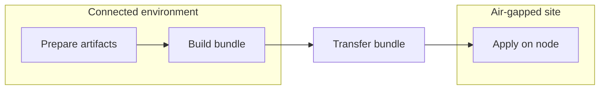
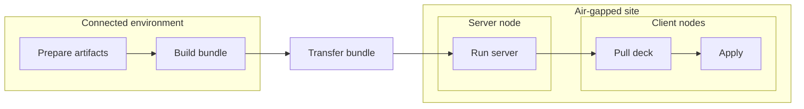

# Architecture

This document explains the architectural shape of `deck`.

`deck` is a local-first workflow tool for air-gapped and operationally constrained environments. The design starts from a simple assumption: collect what you need while connected, carry it across the boundary as an explicit, verifiable bundle, and execute it locally on the machine that needs the change.

For workflow fields, CLI flags, and bundle layout details, see the reference docs. This document focuses on the larger structure behind those details.

## The basic model

The core `deck` lifecycle has three stages:

1. author and validate a workflow
2. prepare the artifacts needed to run it offline
3. apply it locally on the target side

That separation is the center of the architecture.

- **Prepare** resolves network-dependent inputs while connectivity exists.
- **Bundle** turns the workflow, artifacts, and binary into an explicit handoff unit.
- **Apply** performs host changes locally without assuming internet access, SSH, PXE, or a long-lived controller.

By the time `apply` runs, the workflow and its required artifacts should already be present.

## System boundaries

`deck` operates across four practical boundaries:

- **Connected environment**: where workflows are authored, linted, and prepared
- **Transfer boundary**: where prepared content is packaged and moved into the air gap
- **Air-gapped site**: where the bundle is present and a local `deck server` may optionally run
- **Target node**: where `deck apply` performs host mutation locally

This separation is deliberate. The connected side resolves external dependencies. The site side should not have to.

## Manual-first and local-first by design

`deck` is designed around manual-first operations rather than unattended reconciliation.

The normal operating picture is an operator preparing a known workflow, carrying a known bundle into a constrained site, and running an explicit local operation. The system is organized around reviewable workflows, explicit bundle handoff, and node-local execution rather than an always-on controller continuously converging the environment.

That is why the architecture emphasizes:

- reviewable workflows
- explicit bundle handoff
- node-local execution
- optional helpers instead of a mandatory control plane

## Single-node flow

The simplest `deck` workflow is just `prepare -> bundle -> apply`.

- In the connected environment, the operator prepares the artifacts the workflow will need at run time.
- The prepared outputs, workflow files, manifest, and `deck` binary are packaged into a bundle.
- The bundle is transferred across the offline boundary into the target site.
- On the target node, the bundle is unpacked and `deck apply` runs locally.
- Validation, linting, and review normally happen before this flow, but they are omitted from the diagram so the main `prepare -> bundle -> apply` path stays clear.

This is the default path the rest of the architecture is built around: one prepared bundle, one local binary, and one target machine applying a typed workflow.

## Multi-node flow

For multi-node work, the core shape is still `prepare -> bundle -> apply`. The difference is that one node in the site can run the server role, and the other nodes pull what they need from it before running locally.

In practice, that server can act as a local web or file server for the `deck` binary, workflows, and prepared files, and it can also expose a pull-only container registry for prepared images. That keeps the overall model the same while making offline distribution easier inside the site.

- In the connected environment, the operator prepares artifacts and builds the bundle in the same way as the single-node flow.
- After the bundle crosses into the site, one node can take the server role and run `deck server`.
- That server can distribute the `deck` binary, workflow files, prepared files, and prepared images inside the air gap through its local web or file serving path and pull-only registry support.
- Client nodes pull what they need from the server, then run locally on each node.
- The optional server can make bundle distribution easier inside the site, but execution state and run history still belong to the nodes that execute the workflow.

Even here, `deck` is not acting as a central reconciliation controller. The server is a site-local distribution helper: it serves bundle content inside the air gap, but it does not take over node execution. Each node still executes locally.

## Why the bundle is the handoff unit

The bundle is the explicit contract between the connected side and the site.

It carries:

- the `deck` binary
- workflow files
- prepared outputs such as packages, images, and files
- the manifest used for integrity checks

Each part is there for a reason: the binary provides the runner, the workflow provides the intent, the prepared outputs provide the offline inputs, and the manifest provides the integrity contract for what was transferred.

Using a bundle as the handoff unit avoids implicit runtime dependencies. If the site needs it, it should be in the bundle or intentionally provided by the local environment.

## Scenario-oriented workspace

The workspace has gradually been pushed toward scenario entrypoints rather than a highly open-ended graph of workflow fragments.

In practice, the operator-facing entrypoint is expected to be a scenario-shaped workflow that describes a real task. Lower-level components still exist, but they are supporting building blocks rather than the main user-facing abstraction.

This keeps the main path easier to discover and helps examples, validation, bundle indexing, and server listing line up around the same unit of work.

## Typed workflows as the center

`deck` prefers typed steps over shell-heavy procedures. That is an architectural choice, not just a documentation preference.

Typed steps make workflows easier to review, validate, and evolve. They also let the implementation hold clearer boundaries around filesystem access, command execution, runtime outputs, and schema contracts.

`Command` remains available as an escape hatch, but it is not meant to dominate the authoring model.

Another reason for this design is to reduce user confusion. `deck` tries to give common operational work one clear typed shape instead of several overlapping ways to express the same action. The goal is not to model every edge immediately. The goal is to keep the main path simple enough that operators can usually predict which step kind to reach for and what behavior it implies.

## Noun-family step taxonomy

The typed step model is intentionally organized around noun families rather than a large list of unrelated verbs.

Families such as `File`, `Package`, `Image`, `Repository`, and `Wait` group concrete kinds like `DownloadFile`, `InstallPackage`, `VerifyImage`, `RefreshRepository`, and `WaitForFile`. That keeps the schema surface explicit without fragmenting the human-facing docs into dozens of unrelated pages.

When a capability fits an existing family cleanly, extending that family is usually preferred over creating a new unrelated step kind.

## Command surface design

The CLI follows the same simplification goal.

`deck` tries to keep the command surface organized around a small number of lifecycle stages:

- author and validate workflows
- prepare artifacts and bundle inputs
- build and verify the bundle
- execute locally on the target node
- optionally expose site-local bundle distribution helpers

The intent is to avoid a tool shape where several commands appear to solve the same problem with slightly different assumptions. A smaller command model makes the default path clearer and keeps help text, examples, and documentation aligned.

## Simplicity as a usability strategy

`deck` treats simplicity as a usability feature, not just an implementation preference.

In air-gapped operations, predictability usually matters more than configurability. The project therefore tries to narrow the number of primary concepts an operator has to keep in mind at once.

That shows up in several places:

- **standard scaffold shape**: `deck init` creates a fixed project layout instead of many equally valid starting structures
- **fewer variable-definition paths**: variable definitions are encouraged toward central files such as `vars.yaml`
- **limited override surface**: precedence rules are kept narrow so operators can tell where a final value came from
- **restricted component coupling**: components are not meant to become a free-form dependency graph with arbitrary cross-imports and variable passing
- **one obvious main path**: the common case should have one recommended structure for authoring, preparing, bundling, and applying

This is a deliberate tradeoff. Some flexibility is left on the table in exchange for a smaller mental model, clearer docs, and fewer situations where operators need to ask which of several valid shapes they should choose.

## Declarative prepare model

`prepare` is treated as part of the workflow model, not as a separate ad hoc download-script layer.

Artifact gathering is expected to be described declaratively through typed workflow steps and resolved through the same general workflow machinery that supports validation, schema generation, and documentation. That keeps connected-side preparation aligned with the rest of the system instead of drifting into a separate procedural toolchain.

The same workflow tree that explains what will happen on the target side should also explain what must be gathered before crossing the air gap.

## Schema and documentation pipeline

`deck` treats Go model definitions as the primary source of truth for workflow and step structure.

From that typed model, the project derives two other layers:

- **JSON Schema** as the machine-readable contract used for validation and tooling
- **Markdown reference pages** as the human-readable documentation layer

This is intentionally a pipeline rather than three independently maintained descriptions of the same shape. When a typed step changes, the preferred direction is to update the Go model first, regenerate the schema, and then regenerate the user-facing documentation from that contract and its metadata.

Some documentation metadata is layered on top so examples and field descriptions stay useful, but the structural contract should still flow from the typed Go model into schema and then into docs.

## Site-local helper model

When a site needs a shared local source inside the air gap, `deck server` can expose prepared bundle content and audit what it serves. That helper remains secondary to the core local execution path.

## Safety and trust boundaries

Recent refactoring has pushed `deck` toward helper-local trust boundaries.

The principle is simple: feature code should describe intent, while sensitive operations stay localized in small helper layers that are easier to audit.

Important trust boundaries include:

- **filesystem path resolution**: rooted path helpers constrain how paths are resolved within bundle, site, and state roots
- **host path mutation**: host-oriented writes stay explicit rather than being mixed into generic path handling
- **file mode policy**: common permission patterns are centralized instead of open-coded everywhere
- **command execution**: execution helpers separate workflow-driven commands from broader system-level capabilities
- **HTTP response and template rendering**: server output is localized in small response and template helpers

This reduces the need for broad security suppressions in feature code and keeps risky behavior easier to reason about.

## Compatibility and legacy removal

`deck` is still unreleased, so the project currently prefers converging on a smaller canonical model over carrying legacy compatibility layers for every abandoned design.

That means transitional wrappers, duplicate command surfaces, legacy step kinds, and temporary compatibility shims are expected to be removed once the preferred shape becomes clear. The goal is to keep the architecture understandable before release rather than accumulating historical layers that would have to be supported indefinitely.

After release, the compatibility posture is expected to change. At that stage, published contracts should be stabilized through explicit version boundaries such as `apiVersion`, with compatibility managed at those documented edges rather than through implicit support for every previous internal structure.

In other words, compatibility should live at clear boundaries such as workflow schemas, bundle contracts, and published APIs. Internal package layout and transitional implementation details are not the main stability target.

## Failure domains

The architecture tries to keep failures local to the stage that caused them.

- **lint or schema failure** stops the workflow before preparation or execution
- **prepare failure** means the connected side did not produce a complete offline handoff
- **bundle verification failure** means the transferred content cannot be trusted as-is
- **apply failure** affects the target node execution path, not the connected-side artifact pipeline
- **server failure** affects optional site-local helper behavior, not the core local apply model

This keeps the system easier to recover and reason about during real operations.

## What `deck` is not

`deck` intentionally does not aim to be:

- a generic cloud provisioning framework
- a long-lived reconciliation controller
- an SSH-first orchestration tool

It is a structured workflow runner for a narrower class of operational problems where disconnected execution, explicit handoff, and operator clarity matter more than broad platform coverage.

## How the codebase maps to the architecture

The code layout roughly follows these boundaries:

- `cmd/`: CLI entrypoints
- `internal/config` and `internal/workflowexec`: workflow contracts, decoding, and execution rules
- `internal/prepare` and `internal/preparecli`: connected-side preparation logic
- `internal/install`: target-side host mutation and apply behavior
- `internal/bundle`: bundle collection, import, merge, and verify logic
- `internal/server`: optional site-local HTTP server
- `internal/fsutil`, `internal/filemode`, `internal/hostfs`, `internal/executil`: safety-oriented helper boundaries

The exact package layout may continue to evolve, but the architectural direction stays the same: thin CLI layer, typed workflow boundary, explicit trust boundaries, and minimal hidden behavior.

## Extending the system

New capabilities should follow the same shape.

- prefer adding a typed step over expanding `Command` usage
- prefer extending an existing noun family before introducing a new top-level step kind
- keep runtime side effects in focused helper boundaries
- keep prepare-side network work out of apply-side host mutation paths
- avoid expanding override and composition rules unless the added flexibility is clearly worth the extra operator complexity
- document workflow and schema changes together
- keep the default path local-first even when optional server features expand

## Related references

- [Why Deck?](why-deck.md)
- [Workflow Model](../reference/workflow-model.md)
- [Bundle Layout](../reference/bundle-layout.md)
- [CLI Reference](../reference/cli.md)
