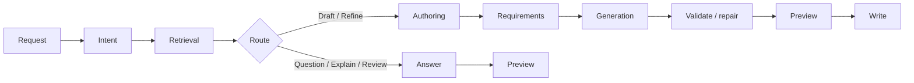

# deck ask

`deck ask` is an experimental authoring helper for working with deck workflows from the current workspace. It can answer questions about an existing workflow, explain or review files, propose changes, and draft workflow YAML when the request is clearly an authoring task.

`ask` is only available in AI-ready builds. Non-AI builds omit the command entirely.

## What `deck ask` does

`deck ask` uses the current workspace as context and routes each request based on intent:

- question: answer a direct workflow question
- explain: explain what an existing file or workflow does
- review: review the current workspace and call out practical issues
- draft: create a new workflow or scenario shape
- refine: modify an existing workflow

By default, `deck ask` previews changes. It only writes workflow files when `--write` is present.

For command-level syntax and subcommands, see [CLI Reference](../reference/cli.md).

## How it works

`deck ask` follows a routed pipeline instead of treating every request like workflow generation.



### Step 1: Normalize the request

`deck ask` starts by normalizing the input request and loading the current workspace. This includes the prompt text, optional `--from` content, saved ask config, and whether the workspace already has files such as `workflows/prepare.yaml`, `workflows/scenarios/apply.yaml`, or `workflows/vars.yaml`.

This early inspection matters because `deck ask` behaves differently in an empty workspace than it does in an existing workflow tree.

### Step 2: Classify the request

Before it decides whether to generate files, `deck ask` classifies the request into a route:

- `question`: answer a direct question
- `explain`: explain an existing file or workflow
- `review`: review the current workspace and call out issues
- `draft`: create a new workflow or scenario
- `refine`: modify an existing workflow

This is the key branching point in the pipeline. Requests such as "what does this workflow do?" should go to explanation, not file generation. Requests such as "add containerd setup" should go to authoring.

### Step 3: Retrieve deck-specific context

After routing, `deck ask` gathers the context needed for that request. The retrieved context can include:

- workflow files from the current workspace
- built-in deck authoring knowledge about workflow topology, components, vars, and step usage
- route-specific guidance for typed steps
- saved local state such as the last lint summary when available

This is where `deck ask` becomes more than a generic model wrapper. It does not rely only on the user's sentence. It combines the sentence with deck's workflow rules and with the actual workspace contents.

### Step 4: Derive authoring requirements

For `draft` and `refine`, `deck ask` derives authoring requirements from the request and the retrieved context. These requirements help decide things such as:

- whether the request assumes offline or air-gapped execution
- which files are likely needed
- whether the target looks like a prepare flow, apply flow, or a split prepare/apply workflow
- how strict the generated output needs to be to satisfy the request

Non-authoring routes do not go through this stage because they return an answer rather than candidate files.

### Step 5: Select a scaffold and generate

For authoring routes, `deck ask` chooses a validated starter shape before generation. Instead of inventing file topology from scratch, it starts from a scaffold that matches deck's expected workspace layout.

That scaffold may point generation toward canonical paths such as `workflows/prepare.yaml`, `workflows/scenarios/`, `workflows/components/`, and `workflows/vars.yaml`.

Generation then fills in that structure with route-appropriate output:

- answer text for `question`, `explain`, and `review`
- candidate workflow files for `draft` and `refine`

### Step 6: Validate and repair

When `deck ask` generates files, it validates the result against deck's rules. That includes generated path checks, YAML shape checks, and workflow/schema validation.

If validation fails, `deck ask` can use structured diagnostics to run a repair pass. Those diagnostics help it target the exact file, field, or shape mismatch instead of retrying blindly.

This validation-and-repair loop is one of the main reasons generated output is more reliable than a single unvalidated model response.

### Step 7: Return a preview, write files, or fall back

By default, `deck ask` previews proposed changes. It only writes files when `--write` is present.

Route behavior differs at the end of the pipeline:

- `question`, `explain`, and `review` return answer-oriented output and do not generate workflow files
- `draft` and `refine` return candidate files and can write them with `--write`
- if model access is unavailable, `explain` falls back to a local structural summary and `review` falls back to local findings
- generation routes fail fast when model output is unavailable because local validation cannot replace generation

In practice, this means `deck ask` is not just a raw prompt wrapper. It uses deck-specific routing, topology, validation, and repair to keep output aligned with the product.

### How `plan` fits into the pipeline

`deck ask plan` uses the same general understanding stages at the front of the pipeline: normalize the request, classify it, gather context, and derive requirements. Instead of immediately trying to return final workflow files, it writes a reusable implementation plan under `./.deck/plan/`.

That plan can then be fed back into the main authoring flow with `--from`, which gives you a safer path for large or ambiguous requests.

## Configure provider and model

Save default settings once:

```bash
deck ask config set \
  --provider openai \
  --model gpt-5.4 \
  --endpoint https://api.openai.com/v1 \
  --api-key "$DECK_ASK_API_KEY"
```

Inspect the effective config:

```bash
deck ask config show
```

Clear saved settings:

```bash
deck ask config unset
```

Supported providers currently include:

- `openai`
- `openrouter`
- `gemini`

You can also override `provider`, `model`, and `endpoint` per command instead of saving them globally.

## Common usage patterns

Ask a direct question:

```bash
deck ask "what does workflows/scenarios/apply.yaml do?"
```

Explain an existing workflow file:

```bash
deck ask "explain what workflows/scenarios/apply.yaml does"
```

Review the current workspace:

```bash
deck ask --review
```

Draft a new workflow:

```bash
deck ask "create an air-gapped rhel9 single-node kubeadm workflow"
```

Preview generated changes and then write them:

```bash
deck ask "add containerd configuration to the apply workflow"
deck ask --write "add containerd configuration to the apply workflow"
```

Use a request file:

```bash
deck ask --from ./request.md
deck ask --write --from ./request.md
```

## Plan mode

Use `deck ask plan` when the request is too large or ambiguous for a good one-shot edit:

```bash
deck ask plan "air-gapped rhel9 kubeadm cluster with prepare/apply split"
```

Plan artifacts are written under `./.deck/plan/` by default. A common follow-up flow is:

```bash
deck ask --from .deck/plan/latest.md "implement this plan"
deck ask --write --from .deck/plan/latest.md "implement this plan"
```

When the request still has blockers, `deck ask` may stop after planning instead of writing weak workflow output.

## Workspace and files

- `deck ask` works against the current workspace by default.
- Ask-specific workspace state lives under `./.deck/ask/`.
- Saved ask config defaults live under `~/.config/deck/config.json` as the top-level `ask` object.
- Generated workflow files must stay within the normal deck workflow tree such as `workflows/prepare.yaml`, `workflows/scenarios/`, `workflows/components/`, and `workflows/vars.yaml`.

## Diagnostics and troubleshooting

`ask.logLevel` controls terminal diagnostics on stderr:

- `basic`: route and provider summary
- `debug`: `basic` plus the user command and MCP/LSP events
- `trace`: `debug` plus classifier and route prompt text

Set it with:

```bash
deck ask config set --log-level trace
```

This is the quickest way to inspect how `deck ask` classified the request and what context it passed into the model.

## Current limitations

- `deck ask` is experimental.
- It depends on model access for authoring routes.
- If model access is unavailable, `explain` falls back to a local structural summary and `review` falls back to local findings.
- Generation routes fail fast when model output is unavailable because local validation cannot replace generation.
- `--max-iterations` only applies to generation routes such as `draft` and `refine`.
